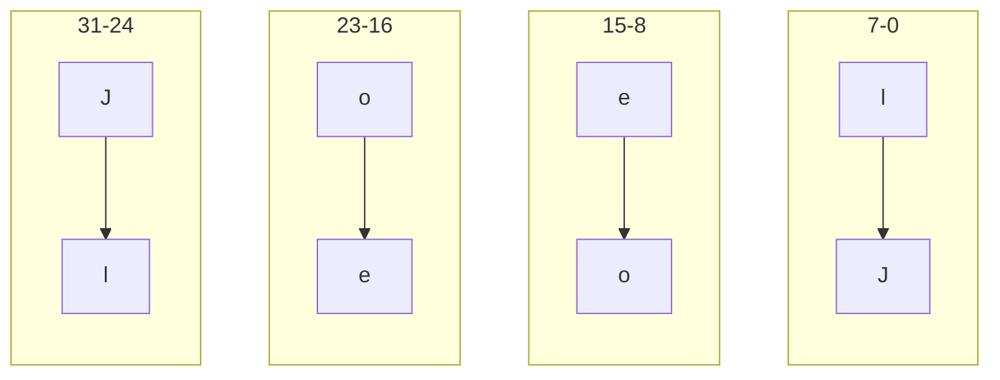
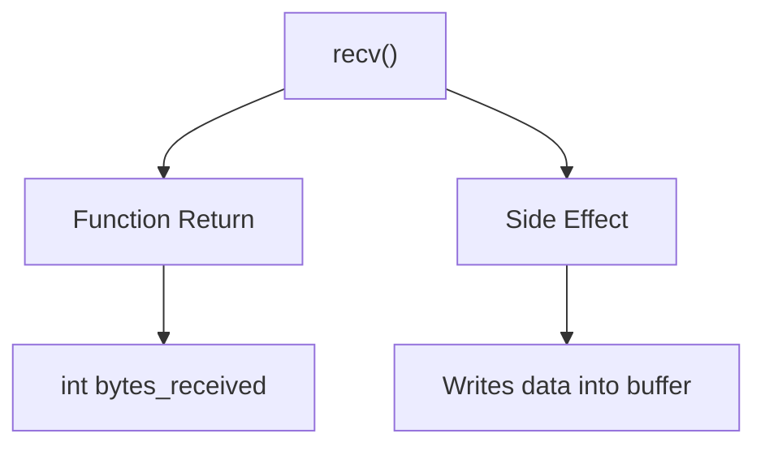
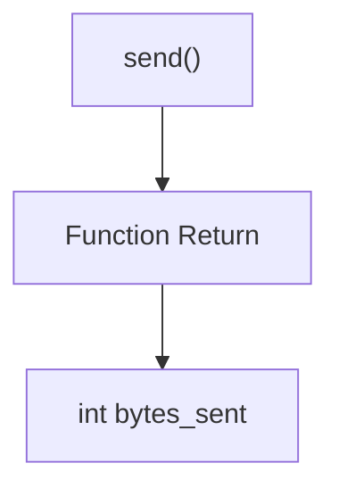
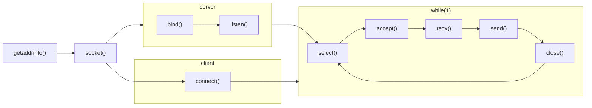

# String reversal (TCP Sockets)
Uses sockets to send a string from a client, reverse the character order of the  string on the server and send the processed string back.
Although production code should use htonl() / ntohl() for clarity and portability, this example demonstrates manual serialization to make byte ordering explicit.

## 32-bit reversal
If we take a 4 byte example like my name "Joel", each letter takes up 8 bits of storage equivalent to up to 0x00 - 0xFF

This would be perfect to serialize "Joel" so that we can send bytes on the wire:
```cpp
    char name[] = "Joel";

    uint32_t wire_value = (static_cast<uint_32>(name[3]) << 24) | (name[2] << 16) | (name[1] << 8) | name[0]; 
```





   

## Context
### Original example
This project is based on exercises from
*Hands-On Network Programming with C* by Lewis Van Winkle.

The original example converts small letters (example 'a') to capatilized letters (example 'A') in a string.
The client socket sends a string, the server socker receives the string, processes the string and sends the updated string back to the client.

### Changes
I kept the client socket as is. 
The server socket was modified so that we could practice **endianess**.

Instead of converting letters to uppercase variants, I reversed the endianness of the string.
If you send "Joel" for example, it will reply with "leoJ"


## recv(peer_fd, buffer, sizeof(buffer), flags)

The function call *recv()* returns the number of bytes received;
as a side effect the user supplied buffer is modified and the data is pushed into the buffer variable

in this example, we set flags to '0' because we don't want to do anything complex yet

### A return value of:
- `> 0` indicates the number of bytes written to the buffer
- `0` indicates the peer has closed the connection
- `< 0` indicates an error and sets `errno`



## send(peer_fd, &data, sizeof(data), flags)

The function call *send* returns the number of bytes sent;


In this example, we set flags to '0' because we don't want to do anything complex yet

### A return value of:
- `> 0` indicates the number of bytes written to the buffer
- `0` indicates that nothing has been sent
- `< 0` indicates an error and sets `errno`





## select()

I used select() because the functions accept(), send() and recv(), does some form of blocking.
Blocking occurs when a program asks the OS to put the calling CPU thread asleep until a defined event occurs. 

By default a program runs on one thread. An alternative to using select is fork(). This makes another process available and works pass the block.

select() uses one thread, but observes when fd's are ready and are less likely to stall an entire program.
This makes it possible for one server socket to talk to many clients at once

select() only allows fd descriptors with  value between 0 and 1024. If the fd's value is 1025, it will not with the function.

### Notes
I noticed that Lewis van Winkle had a select() function with his client socket. This was most likely for demostration purposes;often than not client sockets utilise the blocking.



