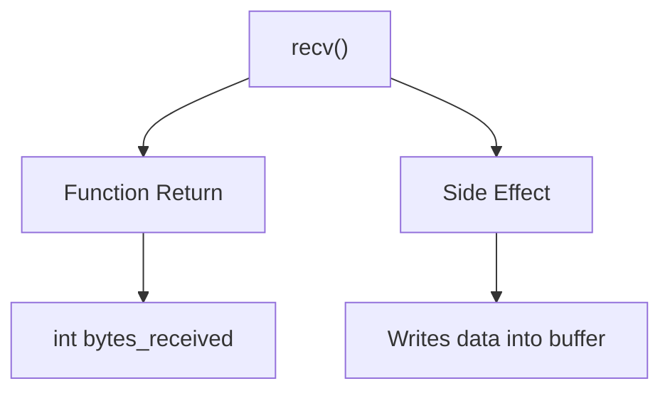
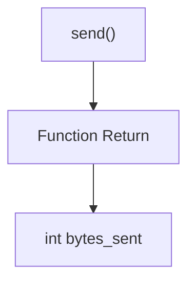

# Endian string reversal (TCP Sockets)
Uses sockets to send a string from a client, reverse the character order of the  string on the server and send the processed string back.

## Context
### Original example
This project is based on exercises from
*Hands-On Network Programming with C* by Lewis Van Winkle.

The original example converts small letters (example 'a') to capatilized letters (example 'A') in a string.
The client socket sends a string, the server socker receives the string, processes the string and sends the updated string back to the client.

### Changes
I kept the client socket as is. 
The server socket was modified so that we could practice **endianess**.

Instead of converting letters to uppercase variants, I reversed the endianness of the string.
If you send "Joel" for example, it will reply with "leoJ"

## recv(peer_fd, buffer, sizeof(buffer), flags)

The function call *recv()* returns the number of bytes received;
as a side effect the user supplied buffer is modified and the data is pushed into the buffer variable

in this example, we set flags to '0' because we don't want to do anything complex yet

### A return value of:
- `> 0` indicates the number of bytes written to the buffer
- `0` indicates the peer has closed the connection
- `< 0` indicates an error and sets `errno`

## send(peer_fd, &data, sizeof(data), flags)

The function call *send* returns the number of bytes sent;

In this example, we set flags to '0' because we don't want to do anything complex yet

### A return value of:
- `> 0` indicates the number of bytes written to the buffer
- `0` indicates that nothing has been sent
- `< 0` indicates an error and sets `errno`

