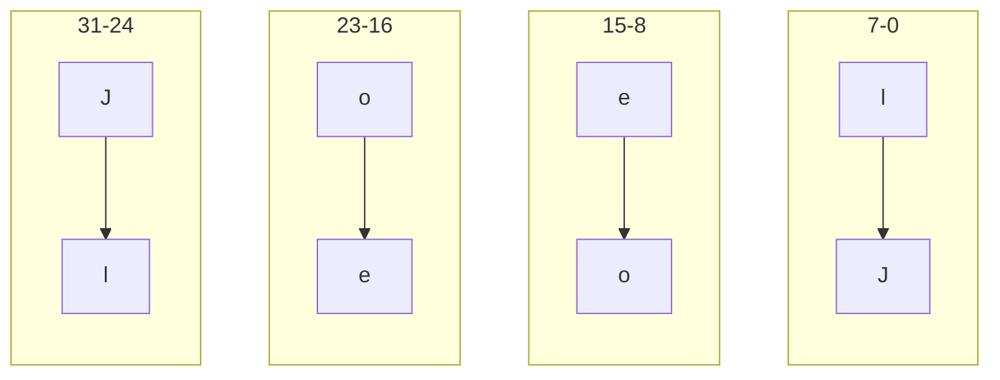

# 32-bit reversal
If we take a 4 byte example like my name "Joel", each letter takes up 8 bits of storage equivalent to up to 0x00 - 0xFF

This would be perfect to serialize "Joel" so that we can send bytes on the wire:
```cpp
    char name[] = "Joel";

    uint32_t wire_value = (static_cast<uint_32>(name[3]) << 24) | (name[2] << 16) | (name[1] << 8) | name[0]; 
```





   
