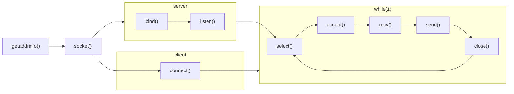

# select()

I used select() because the functions accept(), send() and recv(), does some form of blocking.
Blocking occurs when a program asks the OS to put the calling CPU thread asleep until a defined event occurs. 

By default a program runs on one thread. An alternative to using select is fork(). This makes another process available and works pass the block.

select() uses one thread, but observes when fd's are ready and are less likely to stall an entire program.
This makes it possible for one server socket to talk to many clients at once

select() only allows fd descriptors with  value between 0 and 1024. If the fd's value is 1025, it will not with the function.

### Notes
I noticed that Lewis van Winkle had a select() function with his client socket. This was most likely for demostration purposes;often than not client sockets utilise the blocking.

