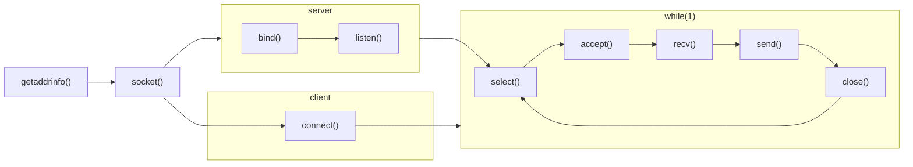

# select()

```mermaid
graph LR
  node_1["getaddrinfo()"] --> node_2["socket()"]
  node_2 --> node_3["connect()"]
  subgraph client
    node_3
    end  
  

  subgraph event_loop["while(1)"]
        direction LR
        select_node["select()"]
        accept_node["accept()"]
        recv_node["recv()"]
        send_node["send()"]
        close_node["close()"]

        select_node --> accept_node
        accept_node --> recv_node
        recv_node --> send_node
        send_node --> close_node
        
        close_node --> select_node
        
    end
subgraph server_loop["server"]
        direction LR
        bind_node["bind()"] -->
        listen_node["listen()"]      
    end
  node_2-->server_loop
  server_loop --> select_node


    node_3 --> event_loop
```
